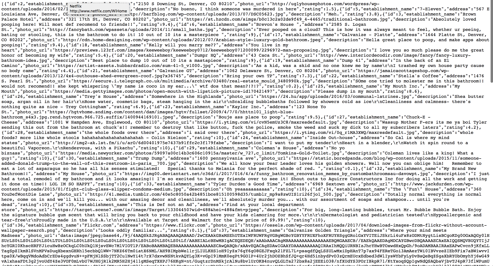

## Dumpr Express Server

Dumpr is a web application that allows users to create bathrooms with a brief description of the bathroom, a photo link, address and rating. You can also view all the bathrooms in hopes of finding a nice one near you!. Think Yelp for bathrooms!

---

This is the server side Express app for Dumpr. It talks to a React client side app that can be found [here](https://github.com/Pleeper228/dumpr-client) and the deployed server can be found [here](https://dumpr-server.herokuapp.com).

---

To install locally:
```
npm install
knex migrate:latest
knex seed:run
npm start
```

The app is now available!



---

> If you have any questions about the app you can email me at brevonbgood@comcast.net!

---

### MY PUBLIC LICENSE

Copyright (C) 2018 Brevon Good

> TERMS AND CONDITIONS FOR COPYING, DISTRIBUTION AND MODIFICATION

1. If you use this just credit me and if you make a lot of money please give me some of it thx!
